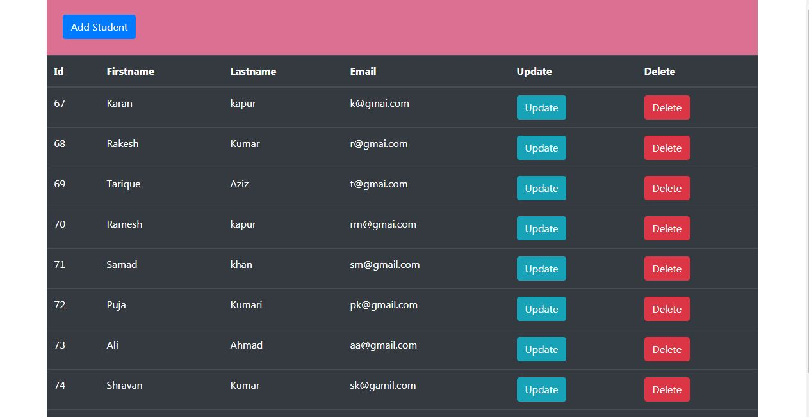
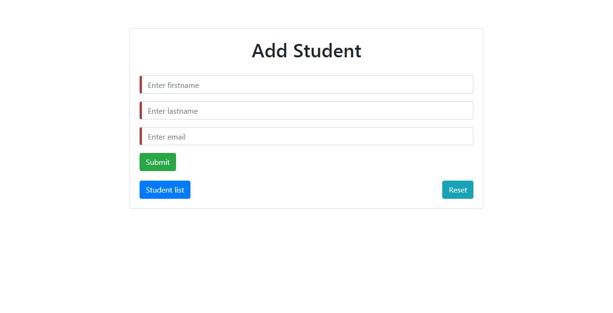
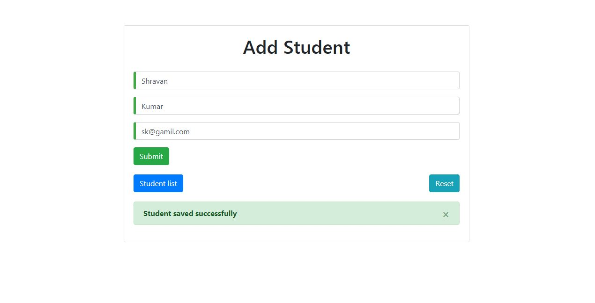
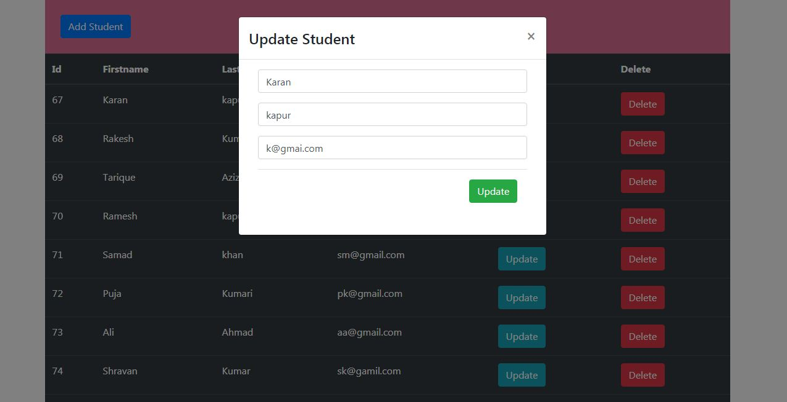
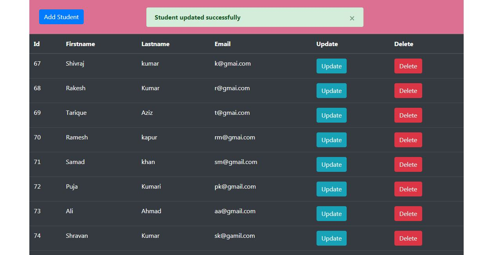
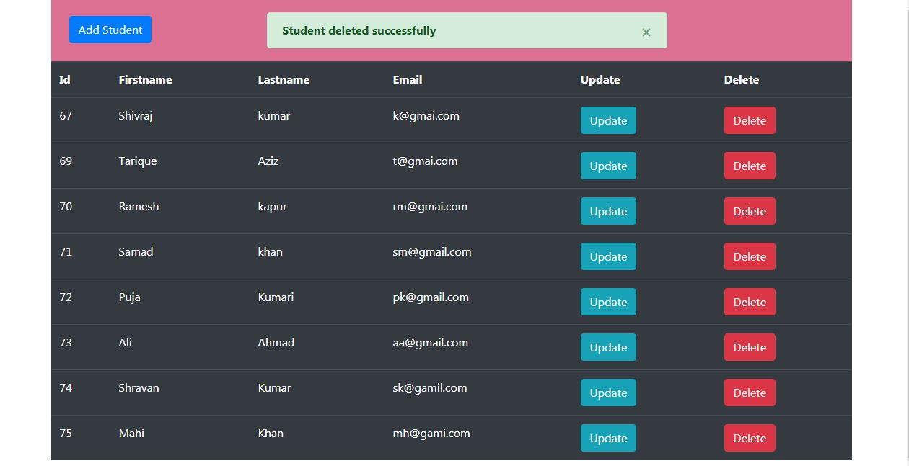

# StudentCRUDApplication
StudentCRUD #Spring Boot
<h2>I have done this project using Spring Boot,Angular and MySQL.</h2>

<h3>This project running on</h3>
<h4>Java 1.8 version or above</h4>
<h4>Angular 11.2 CLI</h4>
<h4>MySQL 6.0 version</h4>

<h3>#Student List</h3>

<h3>#Add Student</h3>

<h3>#Adding Student</h3>

<h3>#Update Student</h3>

<h3>#Updated Student</h3>

<h3>#Delete Student Student</h3>

